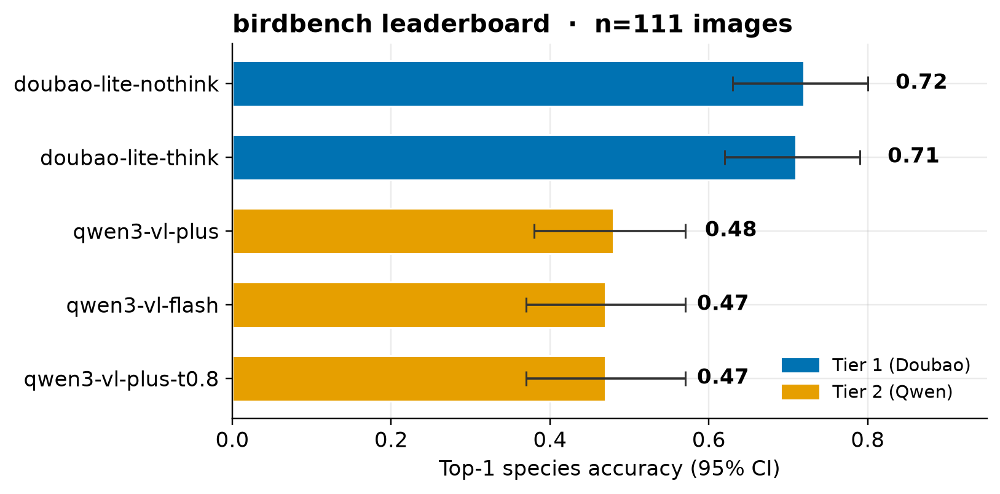
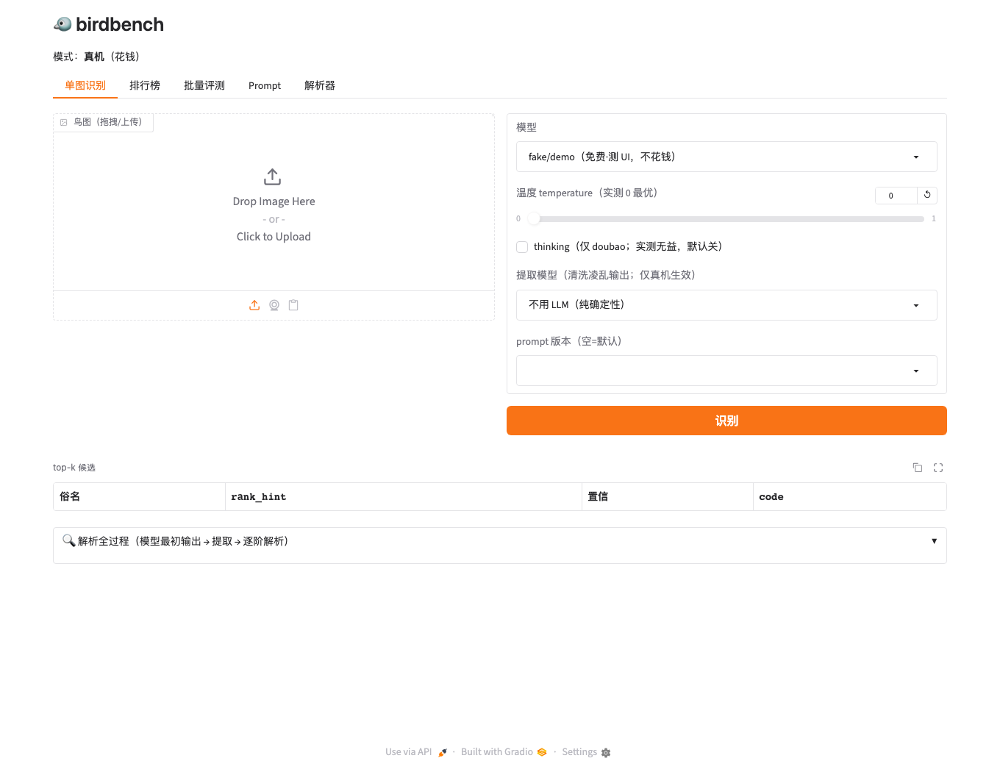

# 🐦 birdbench

**多模型多模态 API · 鸟类开集物种识别评测台**

一张鸟图 → 让各家多模态大模型（豆包 / Qwen-VL / …）开集预测物种 → 确定性解析成 **eBird `speciesCode`** → 分类学表白送 **目/科/属/种** → 跨模型对比**准确率 + 成本**。评分只做 **code == code**（客观、可复现、无 LLM 偏袒）。


---

## 📊 实测排行榜（n=111 图 × 5 模型）



- **第一梯队 doubao-lite `0.72`**，**第二梯队 qwen `0.47`**——CI 不重叠、显著甩 ~24pp（v0 的 n=26 全平打，扩集才打成显著）。
- 产品选型两个 Pareto 最优：**doubao-lite-nothink**（准，$0.00035/正确）、**qwen3-vl-flash**（省，$0.00011/正确）。
- **thinking 对细粒度识别纯浪费**（同分 2× 价）；温度 0 略优于 0.8。
- 成本为官方**挂牌价**（≤32k 档，汇率 7.15），**待真实账单校准**。详见 [`docs/v1-results-111.md`](docs/v1-results-111.md)。

---

## 🖥️ 前端（`birdbench web`，6 tab）



后端已验证的能力**全部前端可配**（温度 / thinking / prompt / 模型 / 提取器 / 采样数）：

| Tab | 能做什么 |
|---|---|
| **单图识别** | 拖图 → 科属种 + top-k + **完整解析 trace**（模型最初输出 → 提取 → 逐阶解析）+ 真实成本 |
| **排行榜** | 看当前榜图 / 传 `predictions.jsonl` → 出显著性 + 校准 + 成本榜（附样例文件） |
| **批量评测** | 配模型集 → 内置111图跑分（**成本估算+cap+确认**闸，demo免费）→ 直出榜；可配 prompt / 采样数 / 提取器 |
| **Prompt** | 列/查看/编辑 prompt 版本，另存新版本（不覆盖契约默认） |
| **解析器** | 任意鸟名 → speciesCode 逐阶 trace；凌乱名由文字 LLM 提取器清洗 |

> demo 模式（默认）用 FakeGateway，不花钱不需 key；`BIRDBENCH_REAL=1` + `.env` key → 真机。

---

## 🔑 核心方法：code-to-code

难点是**同一个种有无数说法**（`Northern Cardinal` / `Cardinalis cardinalis` / `北美红雀`）。我们**不比名字，比码**：

- **gold** 与**预测**都解析到**同一 pinned 分类学快照**的 `speciesCode`；打分 = 两码相等。**不用字符串比对**（太脆）、**不用 LLM 判等**（自我偏袒虚高 10–25%、不可复现、不可审计）。
- **解析器**是确定性 first-hit 梯子（`NORMALIZE → EXACT_CODE/SCI/COM → 中文别名 → 同义 → 剥修饰 → 亚种上卷 → 模糊学名 → 缩写码 → LLM_NORMALIZE → ABSTAIN`）：**拿不准就弃答，绝不瞎猜**；每阶可审计单测。
- **LLM 只当 extractor**（把凌乱名擦干净）**永不当 judge**（判对错），且只在确定性 miss 时才调（省钱）。
- **四桶分离**：A 对 / B 认错种(模型账) / C1 解析漏(解析器账) / D 弃答 → 解析器 bug 不会伪装成模型错误。

完整方法论（含真实案例逐阶走查）见 **[`docs/benchmark-design.md`](docs/benchmark-design.md)**。

---

## 🚀 快速开始

```bash
uv sync                              # 装依赖
cp .env.example .env                 # 填各家 API key（.env 已 gitignore，别提交）

# 前端（推荐）：demo 模式免费试
uv run birdbench web                 # → http://127.0.0.1:7860
BIRDBENCH_REAL=1 uv run birdbench web  # 真机（花钱，用 .env key）

# CLI
uv run birdbench resolve "Cooper's Hawk"          # 名字→speciesCode+科属种
uv run birdbench identify bird.jpg --model volcengine/doubao-seed-2-0-lite-260428
uv run birdbench run data/evalset/manifest.jsonl --models configs/models.json -o runs/
uv run birdbench report runs/predictions.jsonl    # → HTML 榜
```

真机批量跑分先估算 + `$5` cap（见 `scripts/run_eval.py`）。

---

## 🗂️ 布局

```
src/birdbench/
  core.py          predict() 唯一模型 I/O · identify() 产品端一等路径
  gateway.py       LiteLLM Router 薄壳（base64 图 + per-call 成本 + 价格 overlay）
  resolve.py       名字→speciesCode 确定性梯子（+ trace_resolve 透明展示）
  llm_normalize.py 文字 LLM 提取器（extractor 非 judge）
  score.py         top-k · 目科属种逐级 · LCA 部分分 · 四桶分离
  bench.py         async map-reduce + 缓存 + n_samples 自洽采样
  report.py        HTML 榜 + Pareto + McNemar 显著性 + 校准
  stats.py         Clopper-Pearson CI · McNemar 精确检验 · Holm 校正
  calibration.py   AUROC_f / Brier / 过度自信 / AURC
  self_consistency.py  投票 + 语义熵
  prompts.py       版本化 prompt（prompts/*.md，同事可编辑）
  schemas.py       所有 Pydantic 契约（Schema 铁律）
  web.py           Gradio 6-tab   ·   cli.py  Typer
data/taxonomy/     vendored bird-taxonomy 快照（pinned SHA）
data/evalset/      111 图 manifest + images + ATTRIBUTION
docs/              DESIGN / benchmark-design / v1-results / evalset / cost …
configs/           models.json · doubao_price_overlay.json
```

139+ 单测（`pytest`）+ CI；每个 handler 离线可测（FakeGateway）。

---

## 📚 文档

- **[docs/benchmark-design.md](docs/benchmark-design.md)** — 方法论白皮书（code-to-code、四桶、统计诚实、取舍）
- **[docs/v1-results-111.md](docs/v1-results-111.md)** — 111 图功效榜
- **[docs/v1-6-cost.md](docs/v1-6-cost.md)** — 成本校准 / 性价比
- **[docs/evalset.md](docs/evalset.md)** — 评测集构成
- **[docs/DESIGN.md](docs/DESIGN.md)** — 可执行规格
- **[CONTEXT.md](CONTEXT.md)** — 领域术语

---

## ⚖️ License

**非商用**（CC BY-NC 4.0，见 [`LICENSE`](LICENSE)）。评测图片来自 iNaturalist（CC-BY-NC / CC-BY / CC0），逐图署名见 [`data/evalset/ATTRIBUTION.md`](data/evalset/ATTRIBUTION.md)——仅非商业研究评测用。分类学快照为事实性标识符映射（pinned `bird-taxonomy`）。依赖只用 Apache/MIT/CC0。
